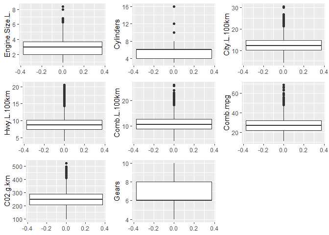
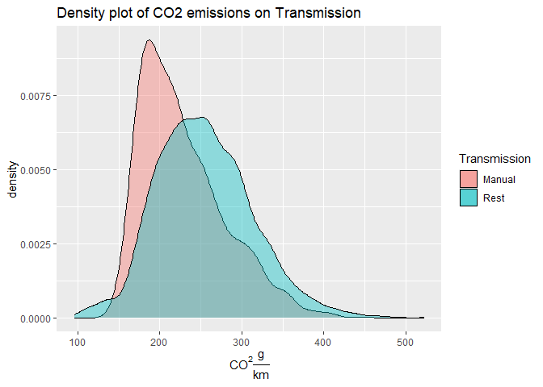
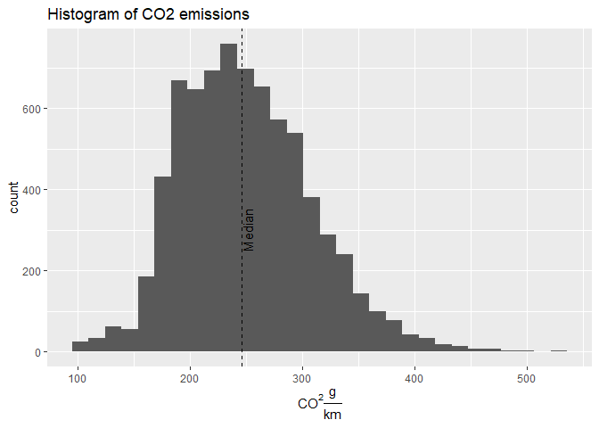
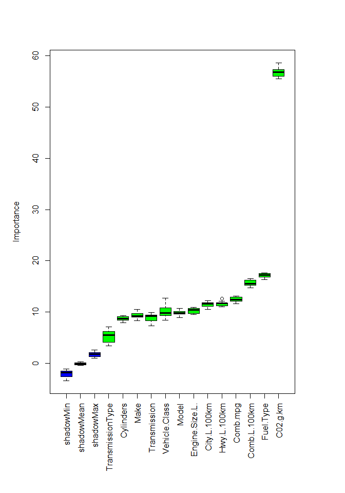
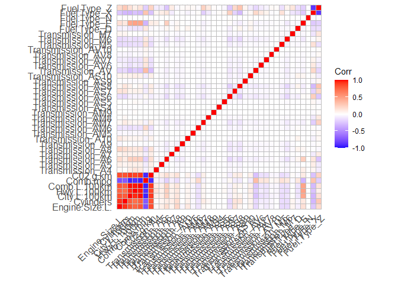
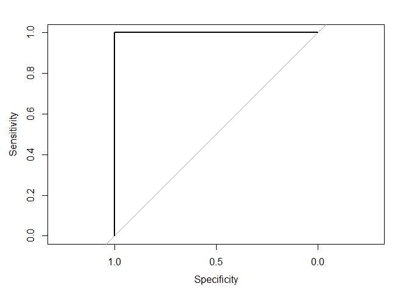

# Libraries

``` r
#install.packages("ggplot2")
library("ggplot2")
#install.packages("gridExtra")
library("gridExtra")
#install.packages("fastDummies)
library("fastDummies")
#install.packages("kableExtra2")
library("kableExtra")
#install.packages("boruta")
library("Boruta")
#install.packages("ggcorrplot")
library("ggcorrplot")
#install.packages("pROC")
library("pROC")
#install.packages("tinytex")
library("tinytex")
#install.packages("webshot")
library("rquery")
#webshot::install_phantomjs()
```

``` r
knitr::opts_chunk$set(fig.path='Figs/')
```

## Loading the data

We will pick the data from the file we produced in the initial Jupyter
Notebook.

``` r
co2<-read.csv("co2_clean.csv")
```

## Outlier check

We will make boxplots to check for outlier values.

``` r
nums<-colnames(co2[sapply(co2,is.numeric)])
myplots <- vector('list', length(nums))
for (i in seq(1:length(nums))){
  message(i)
  myplots[[i]] <- local({
  i <- i
  h<-ggplot(co2, aes(y=.data[[nums[i]]])) +
  geom_boxplot()+scale_fill_brewer(palette="Dark2")+
  labs(y=nums[i])
})
}
do.call("grid.arrange", c(myplots, ncol=3))
```



## Data analysis

We want to know more about correlations, if there is a relationship
between transmission and polution, and we want to see which variables
make the car more polluting. For this, we will do the following

-   Correlations analysis to study the interferences between variables.
-   Hypothesis contrast to study the pollution vs transmission theory.
-   Logistical regression to test the relevance of each variable vs
    vehicle pollution.

For this, we will use three samples.

-   All cars.
-   Manual cars sample.
-   Non-manual cars sample.

``` r
manual_auto <- co2[ ,c("TransmissionType", "C02.g.km")]
comp_manual <- subset(co2 , TransmissionType == "M")
comp_rest <- subset(co2 , TransmissionType != "M")
comp_manual$manual<-"Manual"
comp_rest$manual<-"Rest"
```

## Variance analysis

For our statistical tests we need to check normality and homogeneity of
the variance in the work variables. We will apply the Central Limit
Theorem principle that justifies that samples bigger than 30 will tend
to be normal. We will just double check sizes and plot each
distribution.

``` r
nrow(comp_manual)
```

    ## [1] 1185

``` r
nrow(comp_rest)
```

    ## [1] 6200

``` r
ggplot(data=comp_manual, aes(x=C02.g.km, fill=manual))+ geom_density(alpha=0.4)+
  ggtitle("Density plot of CO2 emissions on Transmission")+geom_density(data = comp_rest, aes(x=C02.g.km), alpha=0.4)+
  xlab(expression(paste(CO^{2},frac(g,km))))+labs(fill="Transmission")
```



Then, we will need to test variances of both samples. It’s a bilateral
test, with a 95% confidence interval where our hypotheses are:

*H*<sub>0</sub> : *σ*<sub>*m**a**n**u**a**l*</sub> = *σ*<sub>*r**e**s**t*</sub>
*H*<sub>1</sub> : *σ*<sub>*m**a**n**u**a**l*</sub> ≠ *σ*<sub>*r**e**s**t*</sub>

``` r
varianceTest <- function(x,y){
  var.test(x,y)
}
varianceTest(comp_manual$C02.g.km, comp_rest$C02.g.km)
```

    ## 
    ##  F test to compare two variances
    ## 
    ## data:  x and y
    ## F = 0.75946, num df = 1184, denom df = 6199, p-value = 2.96e-09
    ## alternative hypothesis: true ratio of variances is not equal to 1
    ## 95 percent confidence interval:
    ##  0.696448 0.830379
    ## sample estimates:
    ## ratio of variances 
    ##          0.7594592

A p-value of almost 0 means there is heterocedasticity between
variances.

## Tests

We will now carry out an hypothesis contrast, with the following
considerations.

1.  It is a 2-sample contrast.

2.  We assume normality and heterocedasticity.

3.  We will use parametric tests, assuming normality.

4.  We will use unilateral tests, as we only want to analyze the
    higher-end of the distribution.

5.  We will work with unknown variance, as theoretically we don’t have
    every single car in Canadian roads in our sample.

6.  Null hypothesys is that manual cars don’t pollute less than the
    others, and alternative is that they do.

Our chosen test is the following:

$$t=\\frac{\\overline{x}\_1-\\overline{x}\_2}{\\sqrt{\\frac{s^2_1}{n_1}+\\frac{s^2_2}{n_2}}}\\sim  t\\nu$$

Critical q norm is:

``` r
qnorm(0.05)
```

    ## [1] -1.644854

This will delimit the null rejection zone, which is (-∞, -1.64\] as well
as the acceptance zone (-1.64, ∞).

We will now make the corresponding test.

``` r
t.test(comp_manual$C02.g.km, comp_rest$C02.g.km,alternative=c("greater"))
```

    ## 
    ##  Welch Two Sample t-test
    ## 
    ## data:  comp_manual$C02.g.km and comp_rest$C02.g.km
    ## t = -15.892, df = 1832.8, p-value = 1
    ## alternative hypothesis: true difference in means is greater than 0
    ## 95 percent confidence interval:
    ##  -29.23217       Inf
    ## sample estimates:
    ## mean of x mean of y 
    ##  228.3460  254.8352

In this case, we can assert the alternative hypothesis proves true, as
p-value is of almost 0, and t-value is of -15.892. Therefore **manuals
pollute more than automatics**.

### Correlations

We will check correlations between variables. We need to transform each
cathegorical variable in boolean.

``` r
results <- dummy_cols(co2, select_columns = c("Transmission", "Fuel.Type"))
results$Fuel.Type<-NULL

nums2<-results[,colnames(results[sapply(results,is.numeric)])]
nums2$Gears<-NULL
source("http://www.sthda.com/upload/rquery_cormat.r")
cormat<-rquery.cormat(nums2, type="flatten", graph = FALSE)
```

    ## Warning: package 'corrplot' was built under R version 4.0.5

    ## corrplot 0.88 loaded

``` r
cormat.ordered<-head(cormat$r[order(abs(cormat$r$cor), decreasing = TRUE),],20)
kable_styling(kable(cormat.ordered, format='html', caption = "Correlations between variables"))
```

<table class="table" style="margin-left: auto; margin-right: auto;">
<caption>
Correlations between variables
</caption>
<thead>
<tr>
<th style="text-align:left;">
</th>
<th style="text-align:left;">
row
</th>
<th style="text-align:left;">
column
</th>
<th style="text-align:right;">
cor
</th>
<th style="text-align:right;">
p
</th>
</tr>
</thead>
<tbody>
<tr>
<td style="text-align:left;">
741
</td>
<td style="text-align:left;">
City.L.100km
</td>
<td style="text-align:left;">
Comb.L.100km
</td>
<td style="text-align:right;">
0.99
</td>
<td style="text-align:right;">
0
</td>
</tr>
<tr>
<td style="text-align:left;">
740
</td>
<td style="text-align:left;">
Hwy.L.100km
</td>
<td style="text-align:left;">
Comb.L.100km
</td>
<td style="text-align:right;">
0.98
</td>
<td style="text-align:right;">
0
</td>
</tr>
<tr>
<td style="text-align:left;">
703
</td>
<td style="text-align:left;">
Hwy.L.100km
</td>
<td style="text-align:left;">
City.L.100km
</td>
<td style="text-align:right;">
0.95
</td>
<td style="text-align:right;">
0
</td>
</tr>
<tr>
<td style="text-align:left;">
595
</td>
<td style="text-align:left;">
Engine.Size.L.
</td>
<td style="text-align:left;">
Cylinders
</td>
<td style="text-align:right;">
0.93
</td>
<td style="text-align:right;">
0
</td>
</tr>
<tr>
<td style="text-align:left;">
671
</td>
<td style="text-align:left;">
Comb.mpg
</td>
<td style="text-align:left;">
City.L.100km
</td>
<td style="text-align:right;">
-0.93
</td>
<td style="text-align:right;">
0
</td>
</tr>
<tr>
<td style="text-align:left;">
708
</td>
<td style="text-align:left;">
Comb.mpg
</td>
<td style="text-align:left;">
Comb.L.100km
</td>
<td style="text-align:right;">
-0.93
</td>
<td style="text-align:right;">
0
</td>
</tr>
<tr>
<td style="text-align:left;">
702
</td>
<td style="text-align:left;">
C02.g.km
</td>
<td style="text-align:left;">
City.L.100km
</td>
<td style="text-align:right;">
0.92
</td>
<td style="text-align:right;">
0
</td>
</tr>
<tr>
<td style="text-align:left;">
739
</td>
<td style="text-align:left;">
C02.g.km
</td>
<td style="text-align:left;">
Comb.L.100km
</td>
<td style="text-align:right;">
0.92
</td>
<td style="text-align:right;">
0
</td>
</tr>
<tr>
<td style="text-align:left;">
600
</td>
<td style="text-align:left;">
Comb.mpg
</td>
<td style="text-align:left;">
C02.g.km
</td>
<td style="text-align:right;">
-0.91
</td>
<td style="text-align:right;">
0
</td>
</tr>
<tr>
<td style="text-align:left;">
635
</td>
<td style="text-align:left;">
Comb.mpg
</td>
<td style="text-align:left;">
Hwy.L.100km
</td>
<td style="text-align:right;">
-0.89
</td>
<td style="text-align:right;">
0
</td>
</tr>
<tr>
<td style="text-align:left;">
666
</td>
<td style="text-align:left;">
C02.g.km
</td>
<td style="text-align:left;">
Hwy.L.100km
</td>
<td style="text-align:right;">
0.88
</td>
<td style="text-align:right;">
0
</td>
</tr>
<tr>
<td style="text-align:left;">
467
</td>
<td style="text-align:left;">
Fuel.Type_X
</td>
<td style="text-align:left;">
Fuel.Type_Z
</td>
<td style="text-align:right;">
-0.86
</td>
<td style="text-align:right;">
0
</td>
</tr>
<tr>
<td style="text-align:left;">
629
</td>
<td style="text-align:left;">
Engine.Size.L.
</td>
<td style="text-align:left;">
C02.g.km
</td>
<td style="text-align:right;">
0.85
</td>
<td style="text-align:right;">
0
</td>
</tr>
<tr>
<td style="text-align:left;">
630
</td>
<td style="text-align:left;">
Cylinders
</td>
<td style="text-align:left;">
C02.g.km
</td>
<td style="text-align:right;">
0.83
</td>
<td style="text-align:right;">
0
</td>
</tr>
<tr>
<td style="text-align:left;">
700
</td>
<td style="text-align:left;">
Engine.Size.L.
</td>
<td style="text-align:left;">
City.L.100km
</td>
<td style="text-align:right;">
0.83
</td>
<td style="text-align:right;">
0
</td>
</tr>
<tr>
<td style="text-align:left;">
737
</td>
<td style="text-align:left;">
Engine.Size.L.
</td>
<td style="text-align:left;">
Comb.L.100km
</td>
<td style="text-align:right;">
0.82
</td>
<td style="text-align:right;">
0
</td>
</tr>
<tr>
<td style="text-align:left;">
701
</td>
<td style="text-align:left;">
Cylinders
</td>
<td style="text-align:left;">
City.L.100km
</td>
<td style="text-align:right;">
0.80
</td>
<td style="text-align:right;">
0
</td>
</tr>
<tr>
<td style="text-align:left;">
738
</td>
<td style="text-align:left;">
Cylinders
</td>
<td style="text-align:left;">
Comb.L.100km
</td>
<td style="text-align:right;">
0.78
</td>
<td style="text-align:right;">
0
</td>
</tr>
<tr>
<td style="text-align:left;">
533
</td>
<td style="text-align:left;">
Comb.mpg
</td>
<td style="text-align:left;">
Engine.Size.L.
</td>
<td style="text-align:right;">
-0.76
</td>
<td style="text-align:right;">
0
</td>
</tr>
<tr>
<td style="text-align:left;">
664
</td>
<td style="text-align:left;">
Engine.Size.L.
</td>
<td style="text-align:left;">
Hwy.L.100km
</td>
<td style="text-align:right;">
0.76
</td>
<td style="text-align:right;">
0
</td>
</tr>
</tbody>
</table>

The analysis is a bit disappointing since all correlations are evident.

### Logistical regression

We will now study emissions via a logistical regression. We can use a
new flag to try to classify cars in two groups: less polluting and more
polluting.

``` r
ggplot(data = co2, aes(x=C02.g.km)) + geom_histogram() +
  annotate(geom = "vline",
             x = median(co2$C02.g.km),
             xintercept = median(co2$C02.g.km),
             linetype = "dashed")+
  annotate(geom = "text",
             label = "Median",
             x = median(co2$C02.g.km),
             y = 300,
             angle = 90, 
             vjust = 1)+
  ggtitle("Histogram of CO2 emissions")+
  xlab(expression(paste(CO^{2},frac(g,km))))
```

    ## Warning: Ignoring unknown aesthetics: x

    ## `stat_bin()` using `bins = 30`. Pick better value with `binwidth`.



``` r
summary(co2$C02.g.km)
```

    ##    Min. 1st Qu.  Median    Mean 3rd Qu.    Max. 
    ##    96.0   208.0   246.0   250.6   288.0   522.0

Median (246 g) of *C**O*<sup>2</sup> will be the limit between groups.

``` r
co2["co2.g.km.binary"] <- cut(co2$C02.g.km, breaks = c(0,246,10000), labels = c("0","1"))
```

``` r
co2.boruta<-co2
co2.boruta$Gears<-NULL
co2.boruta$CO2.g.km<-NULL
boruta.co2 <- Boruta(co2.g.km.binary~., data = co2.boruta, doTrace = 2)
```

``` r
print(boruta.co2)
```

    ## Boruta performed 11 iterations in 13.59054 secs.
    ##  13 attributes confirmed important: C02.g.km, City.L.100km,
    ## Comb.L.100km, Comb.mpg, Cylinders and 8 more;
    ##  No attributes deemed unimportant.

``` r
par(mar=c(10,5,5,5)+.1)
plot(boruta.co2, xlab= "", las=3)
```



``` r
#text(par("usr")[3] - 0.2,  srt = 45, pos = 1, xpd = TRUE)
```

Regression:

``` r
co2.boruta$Model<-NULL
glm.co2<- glm(co2.g.km.binary~., family=binomial, data=co2.boruta)
```

    ## Warning: glm.fit: algorithm did not converge

    ## Warning: glm.fit: fitted probabilities numerically 0 or 1 occurred

``` r
summary(glm.co2)
```

    ## 
    ## Call:
    ## glm(formula = co2.g.km.binary ~ ., family = binomial, data = co2.boruta)
    ## 
    ## Deviance Residuals: 
    ##        Min          1Q      Median          3Q         Max  
    ## -1.999e-03  -2.000e-08  -2.000e-08   2.000e-08   2.839e-03  
    ## 
    ## Coefficients: (4 not defined because of singularities)
    ##                                         Estimate Std. Error z value Pr(>|z|)
    ## (Intercept)                           -7.537e+03  3.603e+05  -0.021    0.983
    ## MakeALFA ROMEO                         5.844e+02  1.413e+05   0.004    0.997
    ## MakeASTON MARTIN                      -3.028e+02  6.835e+04  -0.004    0.996
    ## MakeAUDI                               4.824e+01  5.812e+04   0.001    0.999
    ## MakeBENTLEY                           -1.145e+03  7.585e+04  -0.015    0.988
    ## MakeBMW                                1.079e+01  5.867e+04   0.000    1.000
    ## MakeBUGATTI                           -7.138e+03  2.388e+05  -0.030    0.976
    ## MakeBUICK                              1.721e+01  6.225e+04   0.000    1.000
    ## MakeCADILLAC                           4.534e+01  5.827e+04   0.001    0.999
    ## MakeCHEVROLET                          1.006e+01  5.889e+04   0.000    1.000
    ## MakeCHRYSLER                           4.906e+01  6.084e+04   0.001    0.999
    ## MakeDODGE                              5.683e+01  6.862e+04   0.001    0.999
    ## MakeFIAT                               5.346e+02  6.475e+04   0.008    0.993
    ## MakeFORD                               2.412e+01  6.057e+04   0.000    1.000
    ## MakeGENESIS                           -1.437e+02  1.192e+05  -0.001    0.999
    ## MakeGMC                                1.543e+01  5.974e+04   0.000    1.000
    ## MakeHONDA                              3.470e+01  6.851e+04   0.001    1.000
    ## MakeHYUNDAI                            7.800e+01  6.073e+04   0.001    0.999
    ## MakeINFINITI                          -4.451e+01  6.253e+04  -0.001    0.999
    ## MakeJAGUAR                             7.475e+01  6.754e+04   0.001    0.999
    ## MakeJEEP                               1.142e+02  6.167e+04   0.002    0.999
    ## MakeKIA                                3.384e+01  5.856e+04   0.001    1.000
    ## MakeLAMBORGHINI                       -2.063e+03  7.120e+04  -0.029    0.977
    ## MakeLAND ROVER                         3.835e+01  6.027e+04   0.001    0.999
    ## MakeLEXUS                             -3.814e+01  5.774e+04  -0.001    0.999
    ## MakeLINCOLN                           -8.008e-01  6.292e+04   0.000    1.000
    ## MakeMASERATI                          -9.042e+02  6.315e+04  -0.014    0.989
    ## MakeMAZDA                              8.299e+01  6.018e+04   0.001    0.999
    ## MakeMERCEDES-BENZ                     -1.776e+01  6.068e+04   0.000    1.000
    ## MakeMINI                               3.693e+02  6.023e+04   0.006    0.995
    ## MakeMITSUBISHI                         1.094e+01  5.974e+04   0.000    1.000
    ## MakeNISSAN                            -7.104e+01  8.350e+04  -0.001    0.999
    ## MakePORSCHE                            5.548e+01  6.257e+04   0.001    0.999
    ## MakeRAM                               -4.215e+01  6.638e+04  -0.001    0.999
    ## MakeROLLS-ROYCE                       -2.794e+03  7.514e+04  -0.037    0.970
    ## MakeSCION                              3.345e+02  8.489e+04   0.004    0.997
    ## MakeSMART                              2.178e+03  2.077e+05   0.010    0.992
    ## MakeSRT                               -3.597e+03  2.642e+05  -0.014    0.989
    ## MakeSUBARU                            -2.724e+02  6.795e+04  -0.004    0.997
    ## MakeTOYOTA                             4.894e+01  5.873e+04   0.001    0.999
    ## MakeVOLKSWAGEN                         4.718e+01  6.008e+04   0.001    0.999
    ## MakeVOLVO                              1.111e+02  6.400e+04   0.002    0.999
    ## Vehicle.ClassFULL-SIZE                -6.461e+00  8.194e+03  -0.001    0.999
    ## Vehicle.ClassMID-SIZE                 -1.219e+01  3.463e+03  -0.004    0.997
    ## Vehicle.ClassMINICOMPACT              -3.039e+01  2.379e+04  -0.001    0.999
    ## Vehicle.ClassMINIVAN                  -7.027e+01  4.397e+04  -0.002    0.999
    ## Vehicle.ClassPICKUP TRUCK - SMALL      1.731e+01  1.270e+04   0.001    0.999
    ## Vehicle.ClassPICKUP TRUCK - STANDARD  -2.087e+01  7.744e+03  -0.003    0.998
    ## Vehicle.ClassSPECIAL PURPOSE VEHICLE   4.880e+01  1.249e+04   0.004    0.997
    ## Vehicle.ClassSTATION WAGON - MID-SIZE  5.393e+01  2.627e+04   0.002    0.998
    ## Vehicle.ClassSTATION WAGON - SMALL     6.800e+01  2.915e+04   0.002    0.998
    ## Vehicle.ClassSUBCOMPACT                9.525e-01  2.700e+03   0.000    1.000
    ## Vehicle.ClassSUV - SMALL              -1.334e+01  9.923e+03  -0.001    0.999
    ## Vehicle.ClassSUV - STANDARD           -1.741e+01  1.232e+04  -0.001    0.999
    ## Vehicle.ClassTWO-SEATER               -5.199e+01  1.756e+04  -0.003    0.998
    ## Vehicle.ClassVAN - CARGO              -2.656e+03  2.594e+05  -0.010    0.992
    ## Vehicle.ClassVAN - PASSENGER          -1.792e+03  4.555e+04  -0.039    0.969
    ## Engine.Size.L.                         4.455e+00  3.044e+03   0.001    0.999
    ## Cylinders                              8.509e+00  1.473e+03   0.006    0.995
    ## TransmissionA4                         3.072e+02  3.513e+05   0.001    0.999
    ## TransmissionA5                        -1.530e+02  2.465e+05  -0.001    1.000
    ## TransmissionA6                        -1.094e+01  2.437e+05   0.000    1.000
    ## TransmissionA7                        -4.698e+01  2.451e+05   0.000    1.000
    ## TransmissionA8                        -7.956e+01  2.439e+05   0.000    1.000
    ## TransmissionA9                        -1.851e+01  2.440e+05   0.000    1.000
    ## TransmissionAM5                        8.908e+01  3.535e+05   0.000    1.000
    ## TransmissionAM6                       -4.555e+01  2.463e+05   0.000    1.000
    ## TransmissionAM7                       -3.674e+01  2.435e+05   0.000    1.000
    ## TransmissionAM8                        3.992e+01  2.466e+05   0.000    1.000
    ## TransmissionAM9                       -3.172e+02  3.239e+05  -0.001    0.999
    ## TransmissionAS10                       3.948e+01  2.430e+05   0.000    1.000
    ## TransmissionAS4                        3.354e+01  3.420e+05   0.000    1.000
    ## TransmissionAS5                       -1.841e+02  2.747e+05  -0.001    0.999
    ## TransmissionAS6                       -1.350e+01  2.428e+05   0.000    1.000
    ## TransmissionAS7                        5.329e+01  2.444e+05   0.000    1.000
    ## TransmissionAS8                       -3.507e+01  2.434e+05   0.000    1.000
    ## TransmissionAS9                       -3.467e+01  2.440e+05   0.000    1.000
    ## TransmissionAV                         9.061e+01  2.448e+05   0.000    1.000
    ## TransmissionAV10                       7.997e+02  2.550e+05   0.003    0.997
    ## TransmissionAV6                        2.801e+02  2.466e+05   0.001    0.999
    ## TransmissionAV7                        3.916e+01  2.467e+05   0.000    1.000
    ## TransmissionAV8                        3.385e+02  9.730e+05   0.000    1.000
    ## TransmissionM5                         3.655e+01  2.441e+05   0.000    1.000
    ## TransmissionM6                        -1.600e+01  2.437e+05   0.000    1.000
    ## TransmissionM7                        -3.548e+01  2.435e+05   0.000    1.000
    ## Fuel.TypeE                             1.835e+02  3.734e+04   0.005    0.996
    ## Fuel.TypeN                             1.024e+03  3.576e+05   0.003    0.998
    ## Fuel.TypeX                             6.170e+01  2.872e+04   0.002    0.998
    ## Fuel.TypeZ                             6.378e+01  2.409e+04   0.003    0.998
    ## City.L.100km                           2.031e+01  7.629e+03   0.003    0.998
    ## Hwy.L.100km                            2.885e+01  7.629e+03   0.004    0.997
    ## Comb.L.100km                          -2.614e+01  1.729e+04  -0.002    0.999
    ## Comb.mpg                               2.548e+01  4.515e+03   0.006    0.995
    ## C02.g.km                               2.640e+01  3.012e+02   0.088    0.930
    ## TransmissionTypeAM                            NA         NA      NA       NA
    ## TransmissionTypeAS                            NA         NA      NA       NA
    ## TransmissionTypeAV                            NA         NA      NA       NA
    ## TransmissionTypeM                             NA         NA      NA       NA
    ## 
    ## (Dispersion parameter for binomial family taken to be 1)
    ## 
    ##     Null deviance: 1.0236e+04  on 7384  degrees of freedom
    ## Residual deviance: 3.9376e-05  on 7291  degrees of freedom
    ## AIC: 188
    ## 
    ## Number of Fisher Scoring iterations: 25

Fuel type and consumption are among the most significant variables,
whereas other aren’t as significative, such as brand and car model.

## Graphs

For correlations:

``` r
corrs <- round(cor(nums2), 2)
ggcorrplot(corrs)
```



We see how we have some fuel types as Diesel or Common Petrol where
there is a positive correlation with consumption and *C**O*<sup>2</sup>
emissions, while etanol and premium petrol have negative correlations.

We will plot the ROC curve fot the correlation.

``` r
p1=predict(glm.co2, co2.boruta, type="response")
```

    ## Warning in predict.lm(object, newdata, se.fit, scale = 1, type = if (type == :
    ## prediction from a rank-deficient fit may be misleading

``` r
r1=roc(co2.boruta$co2.g.km.binary,p1, data=co2.boruta)
```

    ## Setting levels: control = 0, case = 1

    ## Setting direction: controls < cases

``` r
plot(r1)
```



``` r
auc(r1)
```

    ## Area under the curve: 1

With an area under the curve of 0.9997, logistical regression model can
be considered as very good. This is because *C**O*<sup>2</sup> emissions
and fuel consumption are very correlated.
